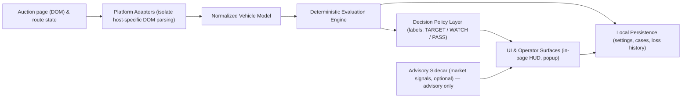

# AO1 — One-Page System Diagram (Public)

This one-page summary is tuned for recruiters and engineering managers: a compact system sketch, runtime boundaries, and the deterministic evaluation path.

At a glance
- Input: live auction page content and navigation state.
- Ingestion: adapters extract and normalize platform-specific data into a stable vehicle model.
- Deterministic core: an economic+risk evaluation path computes non-proprietary outputs used by a policy layer to surface operator-facing labels.
- Advisory sidecar: optional market or model-based signals provide operator-facing context but do not replace deterministic outputs in this public description.
- Interface: results surfaced in an in-page HUD and a small operator popup for case review.

This page is illustrative — full runtime behavior and implementation details are private.
